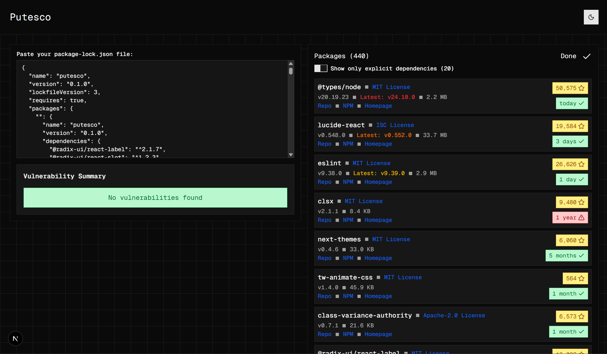

# Putesco

Putesco is a simple webapp that lets you paste in your `package-lock.json` and see if any of the packages have vulnerabilities, how long since their last commit, if they've been archived, and how many stars they have! In other words, it finds dead or rotting packages (this was made to satisfy a "spooky" theme). It deliberately doesn't give a "score" to each package, because you're smart enough to figure out if you should find a replacement for a package based on the info that's provided.



## Running Locally

First, run the development server:

```bash
npm run dev
# or
yarn dev
# or
pnpm dev
# or
bun dev
```

Then, open [http://localhost:3000](http://localhost:3000). Have fun!
